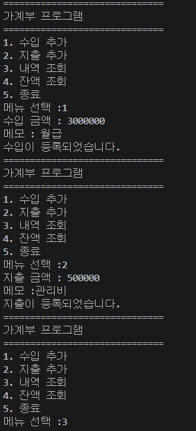
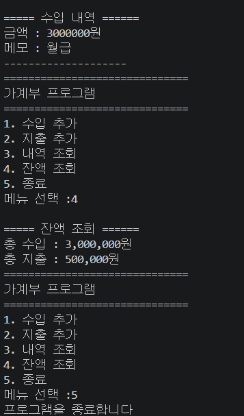
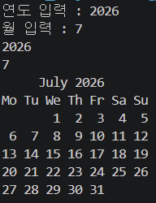
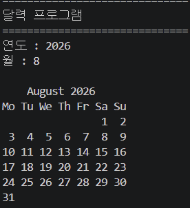
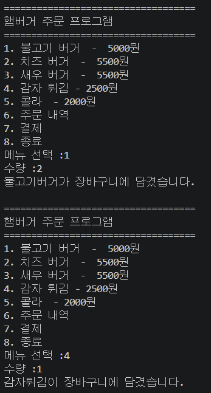
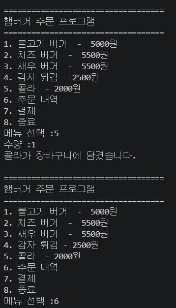
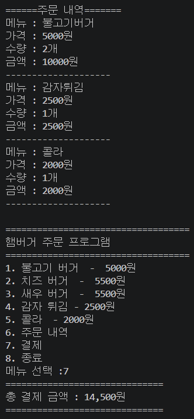
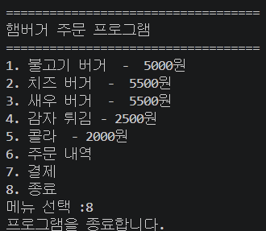

# Python 기초 학습 및 실습 프로그램

Python의 기본 자료형과 문법을 학습하고,
학습한 내용을 활용하여 다양한 콘솔 프로그램을 구현했습니다.

딕셔너리(Dictionary), 집합(Set), 튜플(Tuple)의 특징과 사용 방법을 학습했으며,
조건문, 반복문, 리스트, 딕셔너리 등을 활용하여 가계부, 달력, 주문 프로그램을 작성했습니다.

---

# Python 자료형 학습

## 딕셔너리 (Dictionary)

Python의 딕셔너리 자료형의 기본 구조와 데이터 관리 방법을 학습했습니다.

딕셔너리는 `Key : Value` 구조로 데이터를 관리하며,
웹 프로그램, 데이터베이스, 크롤링 등에서 데이터를 다룰 때 활용할 수 있습니다.

### 학습 내용

- 딕셔너리 생성
- Key / Value 구조
- 데이터 추가 및 삭제
- `del`을 이용한 데이터 삭제
- `pop()`을 이용한 데이터 삭제 및 반환
- `clear()`를 이용한 전체 데이터 삭제
- `update()`를 이용한 딕셔너리 결합
- `keys()`, `values()`, `items()` 활용
- `get()`을 이용한 데이터 조회
- 반복문을 이용한 Key / Value 순회
- `in`을 이용한 Key 존재 여부 확인

### 예제 코드

```python
data = {
    "양파": "채소",
    "수박": "과일",
    "삼겹살": "고기"
}

print(data.keys())
print(data.values())
print(data.items())

for key, value in data.items():
    print(f"key: {key}, value: {value}")
```

---

## 집합 (Set)

Python의 집합 자료형과 기본적인 집합 연산 방법을 학습했습니다.

집합은 중복된 값을 허용하지 않는 특징이 있어
데이터에서 중복 값을 제거할 때 활용할 수 있습니다.

### 학습 내용

- 집합 생성
- 합집합
- 차집합
- 교집합
- `add()`를 이용한 요소 추가
- `remove()`를 이용한 요소 삭제
- `update()`를 이용한 여러 요소 추가
- 중복 데이터 제거

### 예제 코드

```python
a = {0, 1, 2, 3, 4}
b = {3, 4}

print(a - b)  # 차집합
print(a & b)  # 교집합
```

리스트의 중복 값도 집합으로 형 변환하여 제거할 수 있습니다.

```python
my_list = [0, 0, 1, 1, 2, 2, 3, 3, 4, 4]

my_list = list(set(my_list))

print(my_list)
```

---

## 튜플 (Tuple)

Python의 튜플 자료형과 리스트와의 차이점을 학습했습니다.

튜플은 생성된 이후 특정 요소의 값을 변경하거나 삭제할 수 없는
불변(Immutable) 자료형이라는 특징이 있습니다.

### 학습 내용

- 튜플 생성
- 단일 요소 튜플 생성
- 튜플 패킹
- 튜플 언패킹
- 변수 값 교환
- 인덱싱
- 슬라이싱
- 튜플의 불변성

### 패킹과 언패킹

```python
data = 1, 2, 3

a, b, c = data
```

### 변수 값 교환

```python
a = 100
b = 200

a, b = b, a
```

---

# 가계부 프로그램

Python의 리스트와 딕셔너리를 활용하여
콘솔 환경에서 사용할 수 있는 간단한 가계부 프로그램을 구현했습니다.

사용자가 프로그램을 종료하기 전까지 메뉴가 반복적으로 출력되며,
수입과 지출 정보를 입력하고 조회할 수 있도록 구성했습니다.

## 주요 기능

### 수입 추가

수입 금액과 메모를 입력받아 딕셔너리 형태로 저장한 후
수입 리스트에 추가합니다.

```python
income = {
    "금액": money,
    "메모": memo
}

income_list.append(income)
```

### 지출 추가

지출 금액과 메모를 입력받아 딕셔너리 형태로 저장한 후
지출 리스트에 추가합니다.

```python
expense = {
    "금액": money,
    "메모": memo
}

expense_list.append(expense)
```

### 거래 내역 조회

저장된 수입 및 지출 정보를 조회할 수 있도록 구현했습니다.

각 거래 정보는 딕셔너리 형태로 관리하며,
리스트에 저장된 데이터를 반복문으로 하나씩 조회합니다.

### 잔액 조회

등록된 수입과 지출의 합계를 계산하고
총 수입에서 총 지출을 빼 현재 잔액을 계산합니다.

```python
balance = total_income - total_expense
```

### 메뉴 구성

```text
==============================
가계부 프로그램
==============================
1. 수입 추가
2. 지출 추가
3. 내역 조회
4. 잔액 조회
5. 종료
```

`while` 반복문을 사용하여 프로그램이 종료될 때까지 메뉴가 반복되도록 구성했으며,
`if / elif / else` 조건문을 이용하여 선택한 메뉴에 맞는 기능을 실행합니다.

## 가계부 실행 결과

### 실행 결과 1



### 실행 결과 2



---

# 달력 프로그램

Python의 기본 모듈인 `calendar`를 활용하여
사용자가 입력한 연도와 월에 해당하는 달력을 출력하는 프로그램을 구현했습니다.

## 주요 기능

- 연도 입력
- 월 입력
- 입력값을 정수형으로 변환
- `calendar.month()`를 이용한 달력 생성
- 콘솔 화면에 달력 출력

### 주요 코드

```python
import calendar

year = int(input("연도 : "))
month = int(input("월 : "))

print()
print(calendar.month(year, month))
```

프로그램을 실행하면 사용자가 원하는 연도와 월을 입력할 수 있습니다.

```text
==============================
달력 프로그램
==============================
연도 : 2026
월 : 7
```

입력한 정보를 이용하여 해당 월의 달력을 콘솔에 출력합니다.

## 달력 실행 결과

### 실행 결과 1



### 실행 결과 2



---

# 햄버거 주문 프로그램

Python의 리스트와 딕셔너리, 조건문, 반복문을 활용하여
콘솔 기반 햄버거 주문 프로그램을 구현했습니다.

사용자는 메뉴와 수량을 선택하여 주문을 추가할 수 있으며,
저장된 주문 내역을 확인하고 전체 결제 금액을 계산할 수 있습니다.

## 메뉴

```text
===================================
햄버거 주문 프로그램
===================================
1. 불고기 버거 - 5000원
2. 치즈 버거   - 5500원
3. 새우 버거   - 5500원
4. 감자 튀김   - 2500원
5. 콜라        - 2000원
6. 주문 내역
7. 결제
8. 종료
```

## 주요 기능

### 메뉴 주문

사용자가 메뉴와 수량을 입력하면
주문 정보를 딕셔너리 형태로 생성합니다.

```python
order = {
    "메뉴": "불고기버거",
    "가격": 5000,
    "수량": quantity
}
```

생성된 주문 정보는 `order_list`에 저장합니다.

```python
order_list.append(order)
```

### 주문 내역 조회

저장된 주문 정보를 반복문으로 조회하여 다음 정보를 출력합니다.

- 메뉴명
- 가격
- 수량
- 주문 금액

각 주문의 금액은 가격과 수량을 곱하여 계산합니다.

```python
data["가격"] * data["수량"]
```

### 결제 금액 계산

주문 리스트에 저장된 모든 주문을 반복하면서
각 상품의 가격과 수량을 곱하여 전체 결제 금액을 계산합니다.

```python
total = 0

for data in order_list:
    total += data["가격"] * data["수량"]
```

### 프로그램 종료

사용자가 8번 메뉴를 선택하면 `break`를 이용하여
반복문을 종료하고 프로그램을 종료합니다.

## 프로그램 실행 흐름

```text
프로그램 실행
      ↓
메뉴 출력
      ↓
메뉴 선택
      ↓
수량 입력
      ↓
주문 정보 생성
      ↓
주문 리스트 저장
      ↓
주문 내역 조회
      ↓
결제 금액 계산
      ↓
프로그램 종료
```

## 실행 결과

### 실행 결과 1



### 실행 결과 2



### 실행 결과 3



### 실행 결과 4



---

# 사용한 Python 문법 및 기능

이번 학습 및 실습에서 다음과 같은 Python 문법과 기능을 활용했습니다.

- 변수
- 문자열
- 정수형
- 리스트
- 딕셔너리
- 집합
- 튜플
- `input()`
- `print()`
- `int()`
- `append()`
- `len()`
- `for`
- `while`
- `if / elif / else`
- `break`
- f-string
- 반복문을 이용한 합계 계산
- Python 기본 모듈 사용
- `calendar` 모듈

---
## 머신러닝/딥러닝 기초 학습

Python을 활용하여 머신러닝의 중요한 기본인 데이터 처리와 머신러닝 기초 학습을 진행했습니다.

- `_data` : 학습 및 실습에 사용되는 데이터 관리
- `_save` : 학습된 모델 및 결과 데이터 저장
- `keras` : Keras를 활용한 딥러닝 기초 학습
- `ml` : 머신러닝 관련 기초 실습
- `pandas` : Pandas를 활용한 데이터 처리 및 분석 실습

또한 TensorFlow와 Keras를 이용하여 간단한 딥러닝 모델을 직접 구성하고 학습해보았습니다.

```python
import tensorflow as tf
from tensorflow.keras.models import Sequential
from tensorflow.keras.layers import Dense
import numpy as np

# 1. 데이터
x = np.array([1, 2, 3])
y = np.array([1, 2, 3])

# 2. 모델 구성
model = Sequential()
model.add(Dense(1, input_dim=1))

# 3. 컴파일 및 훈련
model.compile(loss="mse", optimizer="adam")
model.fit(x, y, epochs=100)

# 4. 예측
result = model.predict(np.array([4]))

print("4의 예측값 :", result)
```

---

# 학습 및 구현 정리

Python의 기본 자료형인 딕셔너리, 집합, 튜플의 특징과 사용 방법을 학습했습니다.

이후 학습한 문법을 실제 코드에 적용하면서 가계부 프로그램, 달력 프로그램, 햄버거 주문 프로그램을 구현했습니다.

특히 리스트와 딕셔너리를 조합하여 여러 데이터를 저장하고 관리하는 방법과,
조건문과 반복문을 활용하여 사용자 입력에 따라 프로그램의 동작을 제어하는 방법을 연습했습니다.

또한 주문 금액과 가계부 잔액 계산을 구현하면서 저장된 데이터를 반복적으로 조회하고 계산하는 방법을 학습했습니다.

추가로 Pandas를 활용한 데이터 처리와 머신러닝 기초를 학습했으며,
TensorFlow와 Keras를 활용하여 딥러닝의 기본적인 모델 구성, 학습, 예측 과정을 실습했습니다.

이를 통해 데이터를 준비하고 모델을 구성한 뒤 학습을 진행하고,
학습된 모델을 이용하여 새로운 데이터를 예측하는 머신러닝 및 딥러닝의 기본적인 흐름을 학습했습니다.
